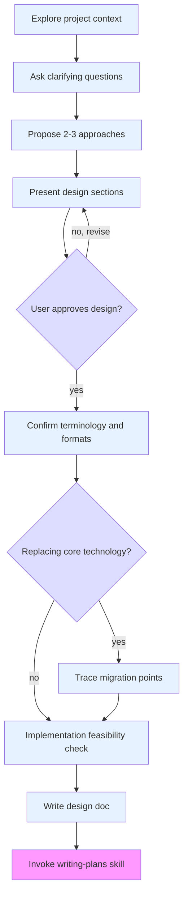

# Brainstorming Ideas Into Designs

## Overview

Help turn ideas into fully formed designs and specs through natural collaborative dialogue.

Start by understanding the current project context, then ask questions one at a time to refine the idea. Once you understand what you're building, present the design and get user approval.

<HARD-GATE>
Do NOT invoke any implementation skill, write any code, scaffold any project, or take any implementation action until you have presented a design and the user has approved it. This applies to EVERY project regardless of perceived simplicity.
</HARD-GATE>

## Anti-Pattern: "This Is Too Simple To Need A Design"

Every project goes through this process. A todo list, a single-function utility, a config change — all of them. "Simple" projects are where unexamined assumptions cause the most wasted work. The design can be short (a few sentences for truly simple projects), but you MUST present it and get approval.

## Checklist

You MUST create a task for each of these items and complete them in order:

1. **Explore project context** — check files, docs, recent commits
2. **Ask clarifying questions** — one at a time, understand purpose/constraints/success criteria
   - **SKIP if:** Requirements doc already has detailed tables/formulas/rules → go directly to Step 3
3. **Propose 2-3 approaches** — with trade-offs and your recommendation
    - **For cross-platform features:** Check official docs for ALL platforms, search for complete solutions, test minimal examples before proposing
    - **Minimal approach first:** What's the simplest working solution? Add complexity only if minimal fails
    - **For CI/CD features:** Use `project-ci-cd` skill to assess needs and check permissions
4. **Present design** — in sections scaled to their complexity, get user approval after each section
   - **Include:** Terminology table, format specifications, validation rules
5. **Confirm terminology and formats** — verify consistency before proceeding
6. **Technology migration validation** — if replacing a core technology, trace ALL usage points
7. **Implementation feasibility check (NEW)** — demonstrate critical logic with pseudo-code before finalizing design
8. **Write design doc** — save to `docs/design/README.md` with project type info and mermaid diagrams
9. **Transition to implementation** — invoke writing-plans skill to create implementation plan

## Process Flow



**The terminal state is invoking writing-plans.** Do NOT invoke frontend-design, mcp-builder, or any other implementation skill. The ONLY skill you invoke after brainstorming is writing-plans.

## The Process

**Understanding the idea:**
- Check out the current project state first (files, docs, recent commits)
- Ask questions one at a time to refine the idea
- Prefer multiple choice questions when possible, but open-ended is fine too
- Only one question per message - if a topic needs more exploration, break it into multiple questions
- Focus on understanding: purpose, constraints, success criteria

**Exploring approaches:**
- Propose 2-3 different approaches with trade-offs
- Present options conversationally with your recommendation and reasoning
- Lead with your recommended option and explain why
- **For cross-platform features:**
  - Check official docs for ALL target platforms
  - Search for "complete solution" examples (not partial)
  - Test minimal working example BEFORE proposing
  - Confirm all required parameters are known
- **Minimal approach first:**
  - What's the SIMPLEST working solution?
  - Test it: Does minimal command/code work?
  - Add complexity ONLY if minimal fails
  - Document why additional complexity is needed
- **For CI/CD features:**
  - Use `project-ci-cd` skill for assessment
  - Check permissions requirements
  - Consider platform-specific configurations

**Presenting the design:**
- Once you believe you understand what you're building, present the design
- Scale each section to its complexity: a few sentences if straightforward, up to 200-300 words if nuanced
- Ask after each section whether it looks right so far
- Cover: architecture, components, data flow, error handling, testing
- Be ready to go back and clarify if something doesn't make sense

**Confirming terminology (Step 5):**
After design approval, verify:
- Enum values match UI labels
- Number formats consistent (decimal 0.2 vs percentage 20%)
- Validation ranges match data formats (0-1 vs 0-100)
- Naming conventions (snake_case for config, etc.)

**Technology migration validation (Step 6):**
This step is triggered when the design replaces a core technology — i.e., any runtime, database, framework, or language that appears in 3+ files or has a public API. Library upgrades or minor dependency swaps do NOT trigger this step.

When triggered, you MUST:
1. Search for ALL files that reference the old technology (use grep)
2. List every file that needs to be updated in the design doc
3. Add a "Migration Checklist" section to the design doc
4. Verify each file will be handled in the implementation plan

Example:
```markdown
## Migration: Lua → Python

### Files to Update
- src/executor/lua_bridge.lua → src/executor/python_runner.py
- src/script/validator.py (lua_script → python_script)
- docs/design/executor/README.md (API examples)

### Migration Checklist
- [ ] Update all references in code
- [ ] Update all references in docs
- [ ] Update all references in examples
- [ ] Verify with grep: no "lua_" remaining
```

State: "This involves a technology migration. I am verifying all files that need updating."

### Step 7: Implementation Feasibility Check (NEW)

**After design approval, before writing design doc:**

For critical logic paths (state machines, first-time vs recurring, complex data flow):
1. Write pseudo-code demonstrating the key logic
2. Identify edge cases in the flow
3. Verify with user: "Does this logic match your expectation?"

**Example pseudo-code:**
```
# color mode: fixed position after first detection
if is_first_detection:
    save_position(target_region)
    extract_color_from_position()
else:
    # Use saved position, don't re-locate
    extract_color_from_saved_position()
```

This catches design gaps early (like "first vs subsequent" logic we missed).

## After the Design

**Documentation:**
1. Write the validated design to `docs/design/README.md`
2. Include project type information (type, platform, language/runtime, build method, CI/CD status)
3. Use mermaid diagrams for architecture visualization
4. **REQUIRED: Include terminology section:**
   - Enum values → UI labels → Documentation terms
   - Number formats (decimal/percentage) with examples
   - Validation ranges for all numeric inputs
   - Naming conventions for config/UI/code
5. Commit the design document to git

**Implementation:**
- Invoke the writing-plans skill to create a detailed implementation plan
- Do NOT invoke any other skill. writing-plans is the next step.

## Key Principles

- **One question at a time** - Don't overwhelm with multiple questions
- **Multiple choice preferred** - Easier to answer than open-ended when possible
- **YAGNI ruthlessly** - Remove unnecessary features from all designs
- **Explore alternatives** - Always propose 2-3 approaches before settling
- **Incremental validation** - Present design, get approval before moving on
- **Be flexible** - Go back and clarify when something doesn't make sense
