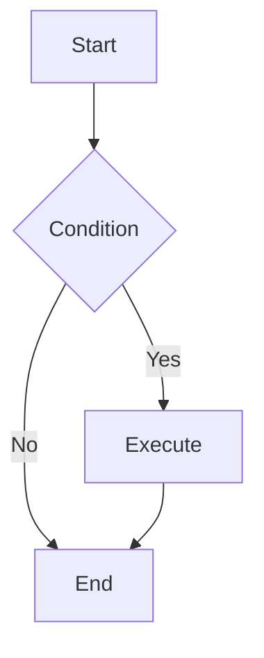
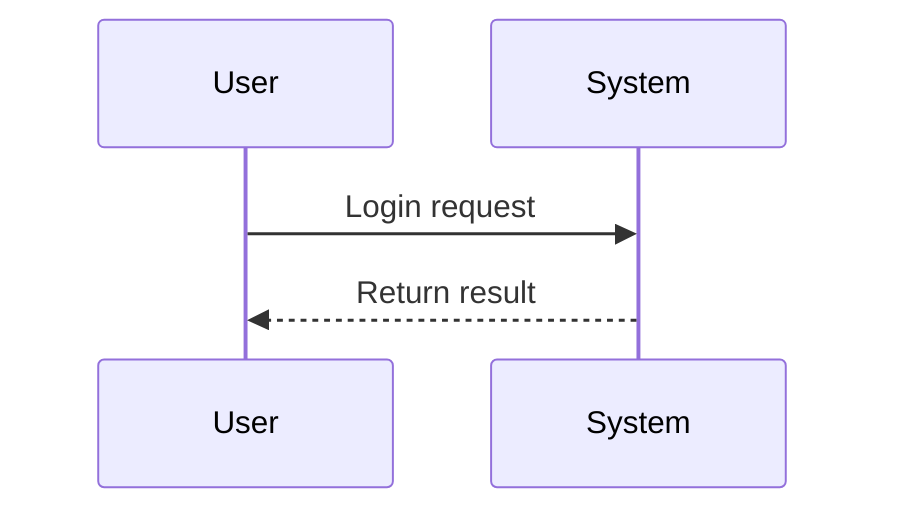
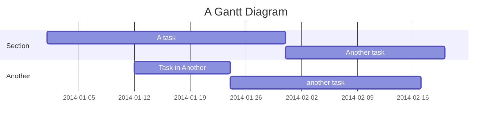
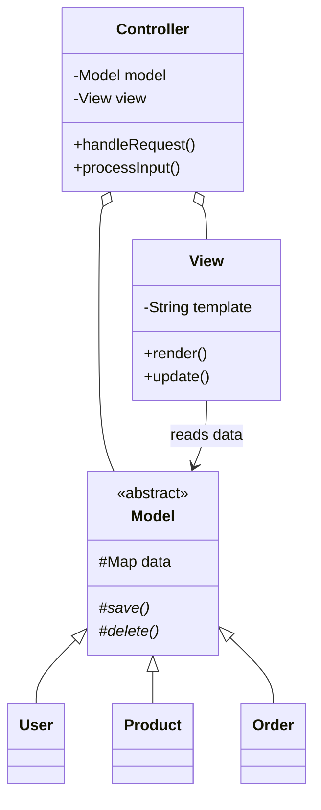
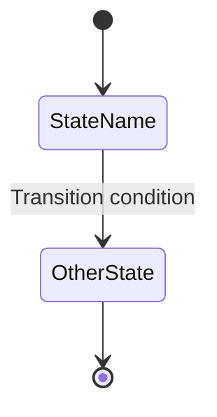
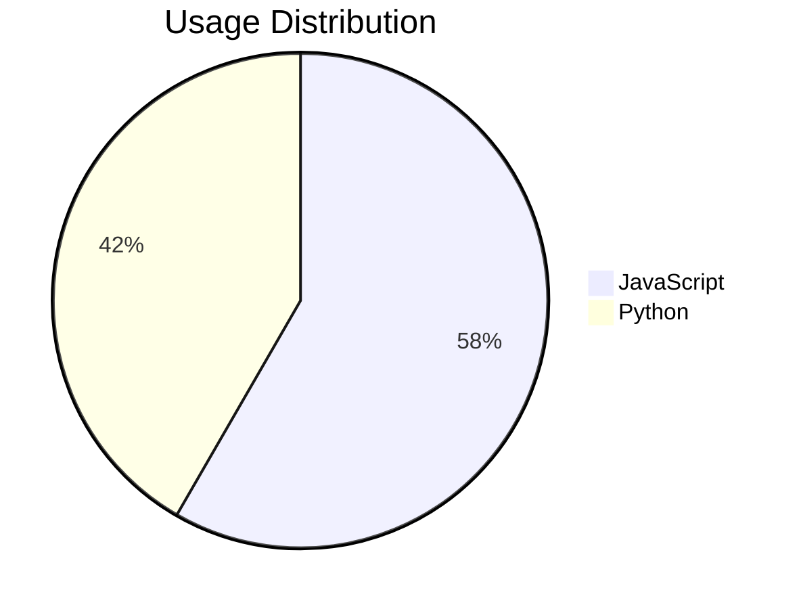
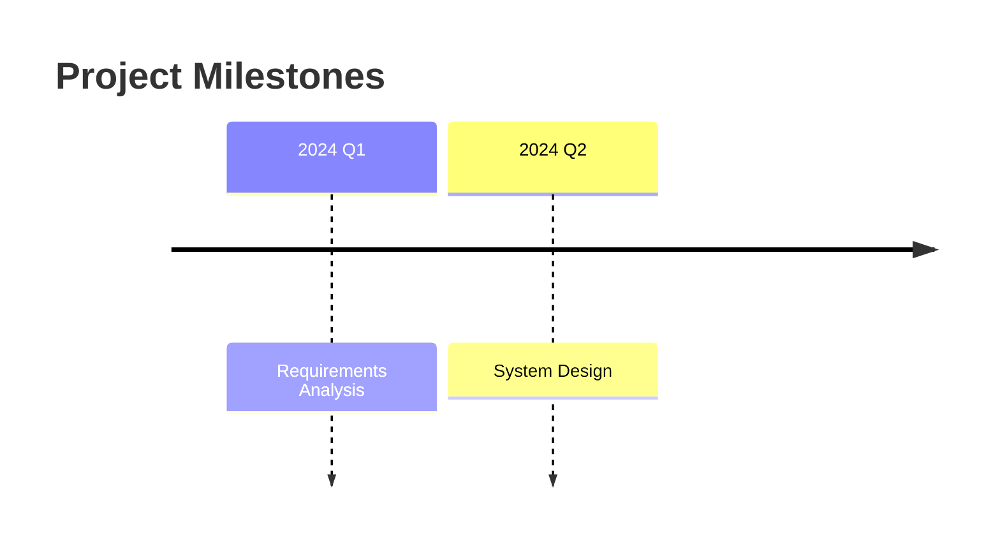
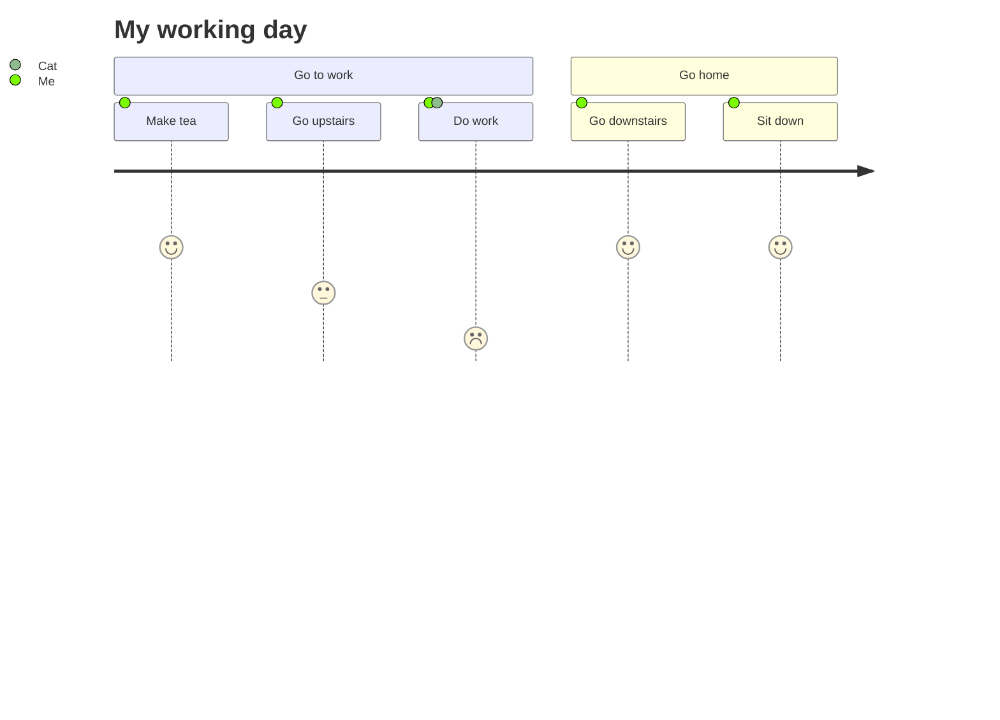
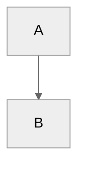

# Mermaid Diagram Creation

## Overview

Help users create various types of mermaid diagram code. Mermaid is a text-based diagramming tool that can render charts directly in Markdown renderers that support mermaid.

## Supported Chart Types

| Chart Type | Use Case | Keywords |
|------------|----------|----------|
| Flowchart | Show processes, decision trees, system architecture | flowchart, graph, process, steps |
| Sequence Diagram | Show interactions and time order between objects | sequence, interaction, message |
| Gantt Chart | Project schedules, timelines | gantt, project plan, schedule |
| Class Diagram | Object-oriented design, class relationships | class, object, UML |
| State Diagram | State machines, state transitions | state, transition |
| Pie Chart | Proportions, distributions | pie, percentage, distribution |
| Timeline | Historical events, milestones | timeline, milestones |
| User Journey | User experience flows | journey, user experience |

## Workflow

1. **Understand requirements** — Ask what type of chart and what content to express
2. **Select chart type** — Choose the appropriate chart type based on user needs
3. **Collect elements** — Understand nodes, relationships, labels needed
4. **Generate code** — Write mermaid code
5. **Validate and adjust** — Refine based on feedback

## Chart Type Details

### Flowchart

Use for: Process steps, decision logic, system architecture, organizational charts

**Direction options:**
- `TD` - Top to Down (default, suitable for most processes)
- `LR` - Left to Right (suitable for horizontal layouts or long processes)

**Node shapes:**
- `A` - Plain node
- `A[]` - Rectangle
- `A()` - Rounded rectangle
- `A((()))` - Circle
- `A>` - Half-circle
- `A{}` - Diamond (decision)
- `A[/]` - Parallelogram

**Connection types:**
- `-->` - Solid arrow
- `---` - Solid line without arrow
- `-.->` - Dashed arrow
- `==>` - Thick solid line

**Example:**

Detailed reference: `references/flowchart.md`

---

### Sequence Diagram

Use for: API call flows, system interactions, message passing, protocol specifications

**Core elements:**
- `participant` - Participant
- `->>` / `-->>` - Solid/dashed message
- `activate` / `deactivate` - Activation bar
- `note` - Note
- `alt/else/end` - Conditional branch
- `loop/par/opt` - Loop/parallel/optional

**Example:**

Detailed reference: `references/sequence.md`

---

### Gantt Chart

Use for: Project planning, task scheduling, progress tracking

**Core elements:**
- `dateFormat` - Date format
- `section` - Grouping
- Task states: `done`, `active`, `crit`
- Time relations: `after`, specific dates

**Example:**

Detailed reference: `references/gantt.md`

---

### Class Diagram

Use for: Object-oriented design, code structure, UML modeling

**Core elements:**
- Class attributes: `+` public, `-` private, `#` protected
- Class methods: `+methodName()`
- Relationships: `<|--` inheritance, `*--` composition, `o--` aggregation

**Example:**

Detailed reference: `references/class.md`

---

### State Diagram

Use for: State machines, lifecycles, state transitions, workflow modeling

**Core elements:**
- `[*]` - Initial/end state
- `-->` - State transition
- `:label` - Transition condition
- `state Name {}` - Composite state
- `<<choice>>` - Choice node
- `<<fork>>` / `<<join>>` - Fork and join
- `note left/right of` - Notes
- `entry/`, `exit/`, `do/` - State actions

**Example:**

**Advanced features:**
- Composite states (nested states)
- Choice nodes for branching logic
- Forks and joins for parallel states
- Notes for documentation
- Styling with `classDef`
- Direction control (`TD`, `LR`, `RL`, `BT`)

Detailed reference: `references/state.md`

---

### Pie Chart

Use for: Data proportions, distributions

**Example:**

Detailed reference: `references/pie.md`

---

### Timeline

Use for: Historical events, development processes, milestones

**Example:**

Detailed reference: `references/timeline.md`

---

### User Journey

Use for: User experience flows, service design

**Core elements:**
- `section` - Phase grouping
- Rating: `5` - Satisfaction 1-5
- Participants: `:User, System`

**Example:**

Detailed reference: `references/journey.md`

---

## Theme Configuration

You can change chart themes with this configuration:

**Available themes:**
- `default` - Default theme
- `neutral` - Neutral (suitable for printing)
- `dark` - Dark theme
- `forest` - Green theme
- `base` - Base theme (customizable)

---

## Best Practices

1. **Choose the right chart type** - Select the most appropriate chart for the content
2. **Keep it simple** - Avoid too many nodes causing clutter
3. **Use meaningful labels** - Node and connection labels should be clear
4. **Group logically** - Use section or subgraph to organize related content
5. **Test rendering** - Verify charts render correctly after generation

## When to Use This Skill

- User says "draw a flowchart/sequence diagram/..."
- User wants to visualize a process or system
- User mentions mermaid or needs Markdown diagrams
- User wants to show data proportions or timelines
- User needs UML diagrams (class diagrams, state diagrams, etc.)
