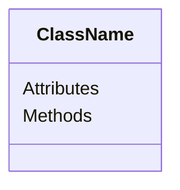
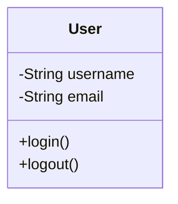
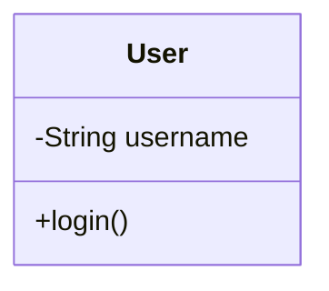
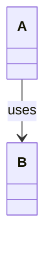
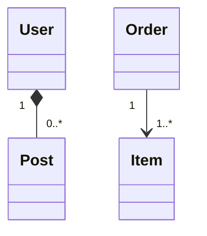
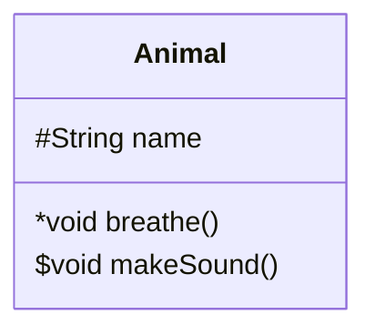
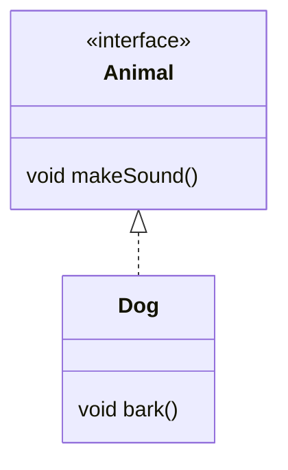
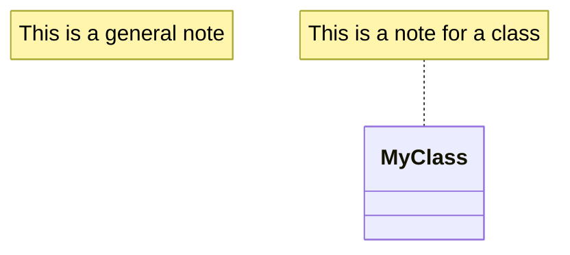
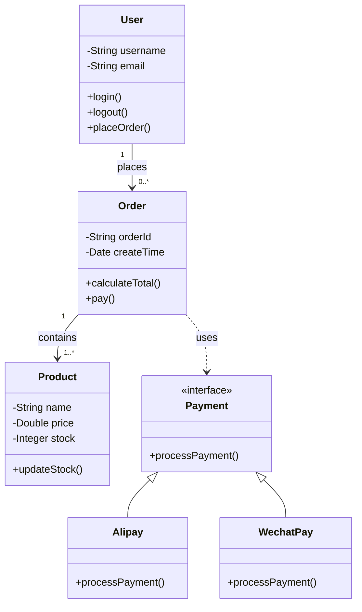
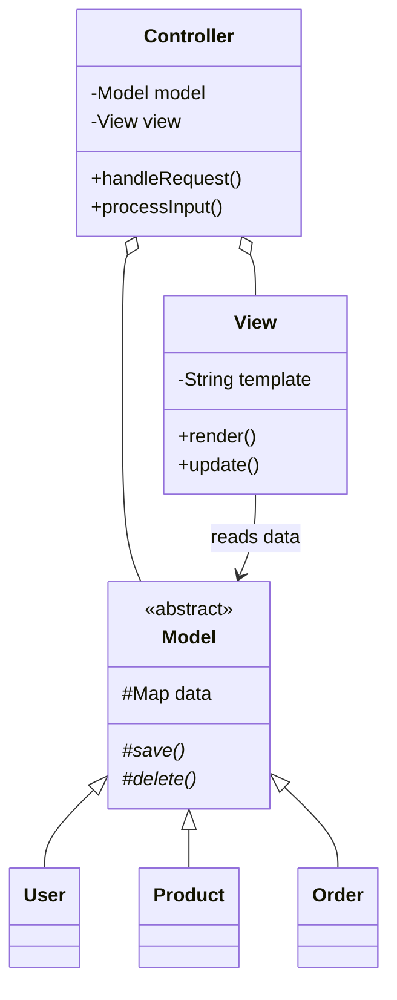

# Class Diagram Detailed Syntax

## Basic Syntax

## Member Visibility

| Prefix | Visibility |
|--------|------------|
| `+` | Public |
| `-` | Private |
| `#` | Protected |
| `~` | Package |

## Member Types

| Symbol | Type |
|--------|------|
| (none) | Normal member |
| `*` | Static |
| `$` | Abstract |
| `()` | Method |

## Defining Classes

### Full Definition

### Shorthand Definition

## Class Relationships

| Relationship | Syntax | Description |
|--------------|--------|-------------|
| Inheritance/Generalization | `<|--` | Subclass extends parent |
| Implementation | `<|..` | Class implements interface |
| Composition | `*--` | Strong ownership |
| Aggregation | `o--` | Weak ownership |
| Association | `-->` | Usage relationship |
| Dependency | `..>` | Temporary dependency |

### Labeled Relationships

### Multiplicity Relationships

## Abstract Classes

## Interfaces

## Notes

## Complete Examples

### E-commerce System

### MVC Architecture

## Common Use Cases

1. **Code structure** - Show classes, interfaces, relationships
2. **Design patterns** - Describe roles in patterns
3. **Database design** - Entity relationship diagrams
4. **System architecture** - Module dependencies
