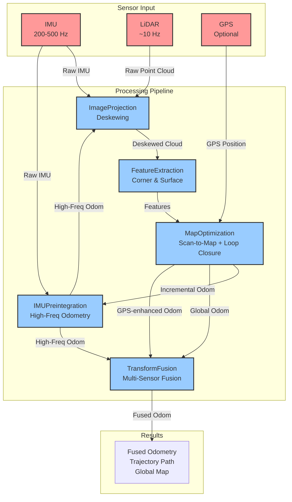

```mermaid
flowchart TB
    subgraph Sensors["Sensor Input"]
        IMU[IMU<br/>200-500 Hz]
        LIDAR[LiDAR<br/>~10 Hz]
        GPS[GPS<br/>Optional]
    end

    subgraph Modules["Processing Pipeline"]
        IP[ImageProjection<br/>Deskewing]
        FE[FeatureExtraction<br/>Corner & Surface]
        MO[MapOptimization<br/>Scan-to-Map + Loop Closure]
        IMU_PRE[IMUPreintegration<br/>High-Freq Odometry]
        TF[TransformFusion<br/>Multi-Sensor Fusion]
    end

    subgraph Output["Results"]
        USER[Fused Odometry<br/>Trajectory Path<br/>Global Map]
    end

    IMU -->|Raw IMU| IP
    IMU -->|Raw IMU| IMU_PRE
    LIDAR -->|Raw Point Cloud| IP
    GPS -->|GPS Position| MO

    IP -->|Deskewed Cloud| FE
    FE -->|Features| MO
    MO -->|Incremental Odom| IMU_PRE
    MO -->|Global Odom| TF
    IMU_PRE -->|High-Freq Odom| IP
    IMU_PRE -->|High-Freq Odom| TF
    TF -->|Fused Odom| USER
    MO -->|GPS-enhanced Odom| TF

    classDef sensor fill:#ff9999,stroke:#333,stroke-width:2px
    classDef module fill:#99ccff,stroke:#333,stroke-width:2px

    class IMU,LIDAR,GPS sensor
    class IP,FE,MO,IMU_PRE,TF module
```
