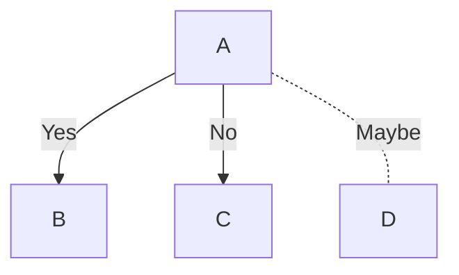
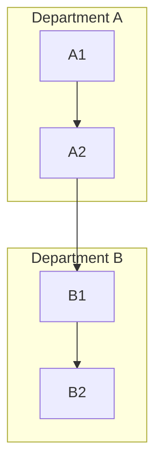
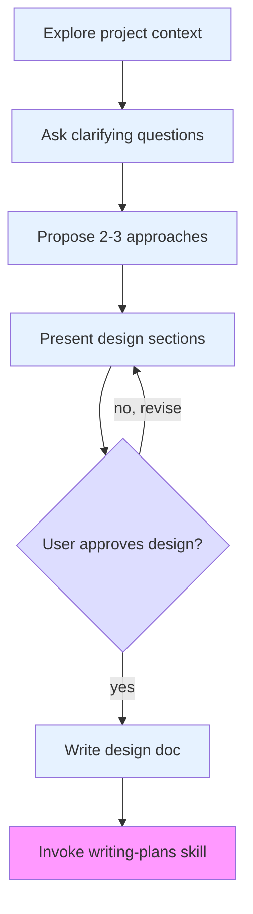
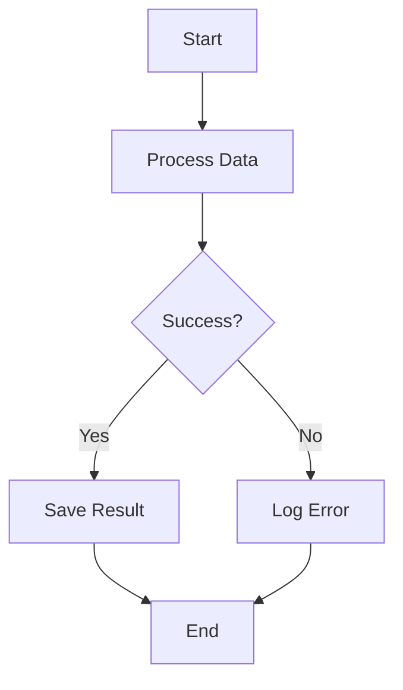
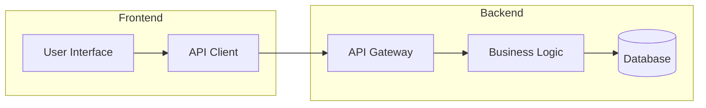

# Flowchart Detailed Syntax

## Basic Syntax


## Direction

Place after `graph`:

| Code | Direction |
|------|-----------|
| `graph TD` | Top to Down |
| `graph LR` | Left to Right |
| `graph RL` | Right to Left |
| `graph BT` | Bottom to Top |

## Node Shapes

| Syntax | Shape | Example |
|--------|-------|---------|
| `A` | Plain node | `A` |
| `A[]` | Rectangle | `A[Rectangle]` |
| `A()` | Rounded rectangle | `A(Rounded)` |
| `A((()))` | Circle | `A((Circle))` |
| `A>` | Half-circle | `A>Half]` |
| `A{}` | Diamond (decision) | `A{Decision}` |
| `A[/]` | Parallelogram | `A[/Parallelogram/]` |
| `A[\]` | Inverse parallelogram | `A[\Inverse/]` |
| `A[(())]` | Cylinder | `A[(Cylinder)]` |
| `A[[ ]]` | Double rectangle | `A[[Double]]` |

## Connection Types

| Syntax | Type | Example |
|--------|------|---------|
| `-->` | Solid arrow | `A --> B` |
| `---` | Solid line | `A --- B` |
| `-.->` | Dashed arrow | `A -.-> B` |
| `-. -` | Dashed line | `A -. - B` |
| `==>` | Thick solid arrow | `A ==> B` |
| `===` | Thick solid line | `A === B` |
| `\|label\|` | With label | `A -->\|Yes\| B` |

## Labels on Connections



## Subgraphs



Syntax:
```
subgraph Title
    Node1 --> Node2
end
```

## Styling with classDef

Define custom styles for nodes and apply them using the `class` keyword.



**Syntax:**
```
classDef styleName property:value,property2:value2
class NodeName1,NodeName2 styleName
```

## Complete Examples

### Simple Flow



### System Architecture



## Common Use Cases

1. **Business process flows** - Use TD direction, diamond for decisions
2. **System architecture** - Use subgraph grouping, LR direction
3. **Decision trees** - Multiple levels of diamond decisions
4. **Organization charts** - Use TD for clear hierarchy
