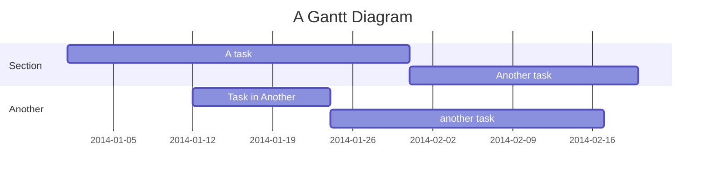
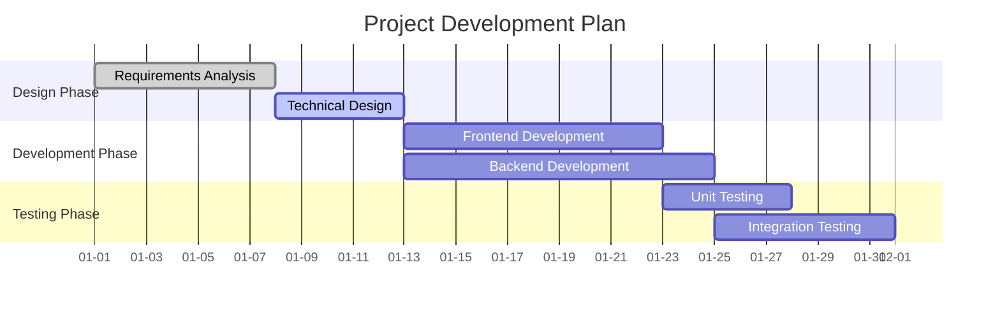
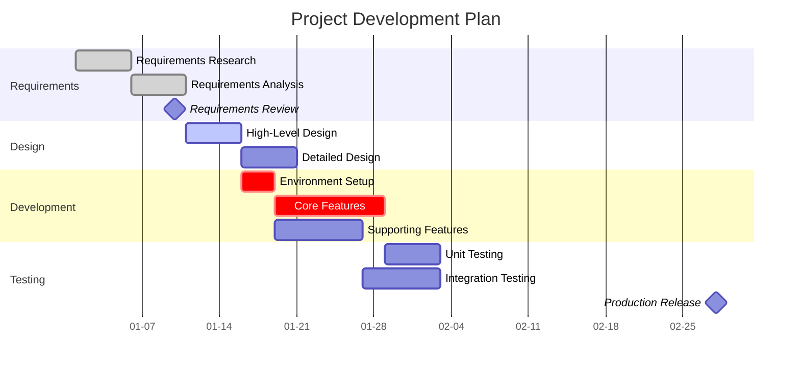

# Gantt Chart Detailed Syntax

## Basic Syntax



## Configuration

### Date Formats

| Format | Example |
|--------|---------|
| `YYYY-MM-DD` | 2024-01-15 |
| `YYYY-MM` | 2024-01 |
| `MM-DD` | 01-15 |
| `YYYY-MM-DD HH:mm` | 2024-01-15 10:00 |

### Axis Configuration

```
axisFormat %Y-%m-%d
todayMarker off
```

## Task States

| State | Description | Display |
|-------|-------------|---------|
| `done` | Completed | Gray |
| `active` | In progress | Blue highlight |
| `crit` | Critical task | Red |
| `milestone` | Milestone | Diamond marker |

## Time Definitions

### Absolute Time
```
Task1 : 2024-01-01, 2024-01-10
Task2 : 2024-01-05, 7d
```

### Relative Time
```
Task1 : 2024-01-01, 7d
Task2 : after Task1, 5d
Task3 : after Task2, 3d
```

### Duration Units
- `d` - Days
- `w` - Weeks
- `h` - Hours
- `m` - Minutes

## Section Grouping



## Milestones

```
Project Kickoff :milestone, m1, 2024-01-01, 0d
Project Launch :milestone, m2, 2024-03-31, 0d
```

## Complete Example

### Project Development Plan



## Advanced Configuration

### Exclude Weekends
```
includes
    excludes weekends
```

### Time Range
```
title Project Plan
dateFormat YYYY-MM-DD
axisFormat %m-%d
```

## Common Use Cases

1. **Project planning** - Multi-phase, multi-task project scheduling
2. **Progress tracking** - Mark progress with done/active states
3. **Critical path** - Mark critical tasks with crit
4. **Milestone management** - Mark important checkpoints
