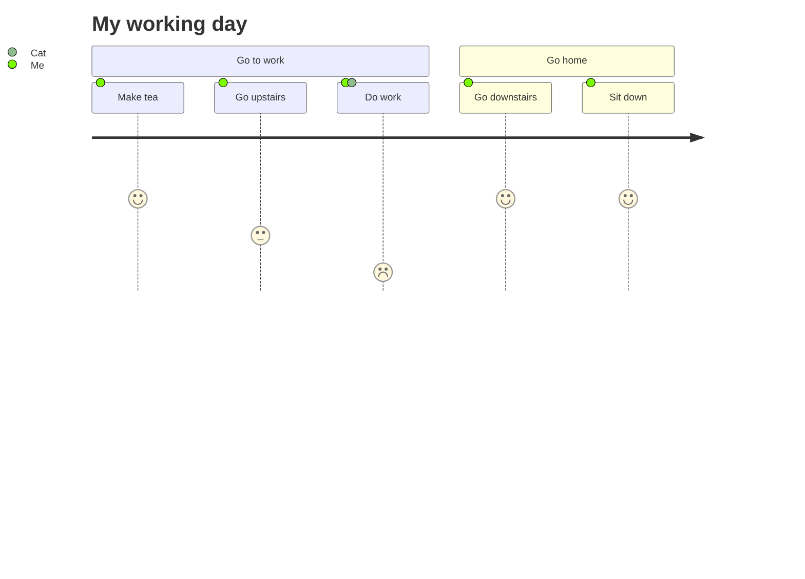
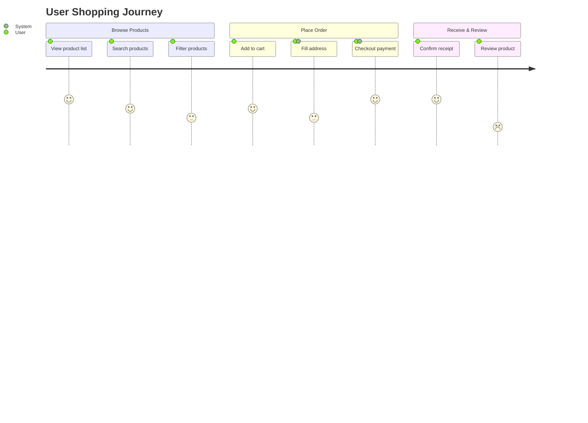
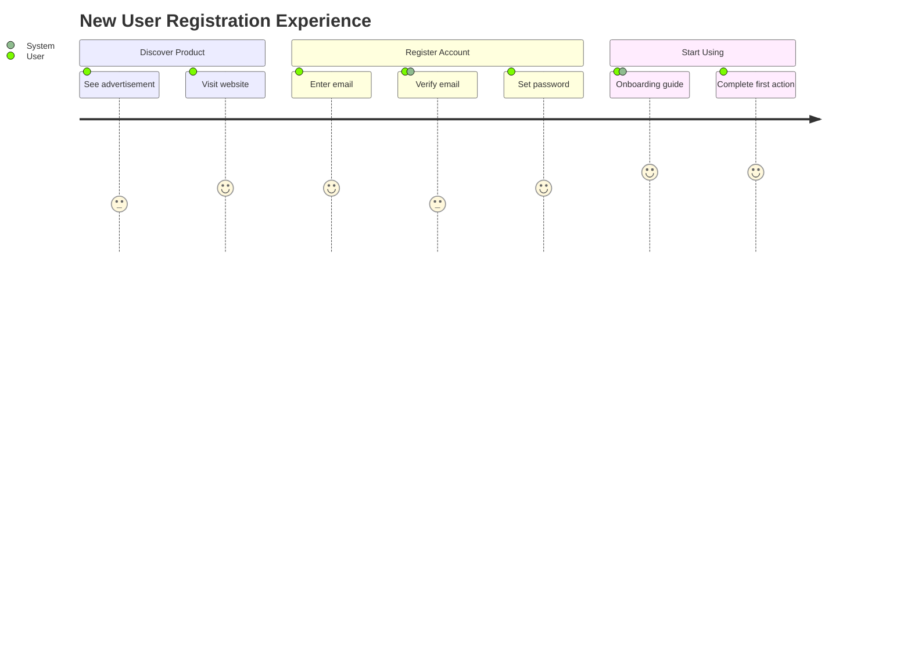
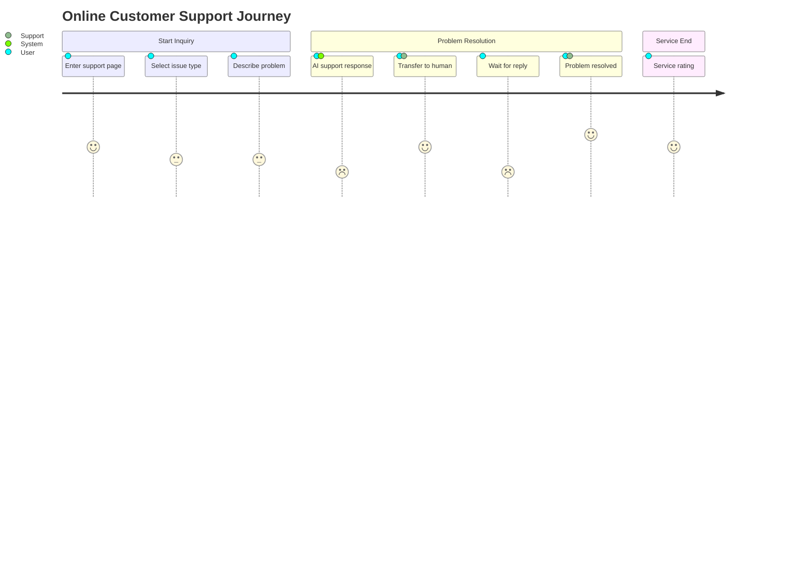

# User Journey Detailed Syntax

## Basic Syntax



## Structure

### Basic Elements

1. **title** - Journey title
2. **section** - Phase/group name
3. **Task items** - Specific tasks with score and participants

### Task Format

```
Task Description: Score (1-5): Participant 1, Participant 2
```

## Score Guide

| Score | Meaning |
|-------|---------|
| 5 | Very satisfied/Smooth |
| 4 | Satisfied |
| 3 | Neutral |
| 2 | Dissatisfied |
| 1 | Very dissatisfied |

## Participants

Can be any role:
- User
- System
- Support
- Merchant
- etc.

Separate multiple participants with commas.

## Complete Examples

### E-commerce Shopping Flow



### User Registration Flow



### Customer Support Flow



## Design Guidelines

1. **Clear phase divisions** - Group by natural user experience stages
2. **Scores reflect real experience** - Low scores are optimization priorities
3. **Mark participants** - Clarify who participates in each task
4. **Cover complete flow** - Full journey from start to end

## Common Use Cases

1. **UX optimization** - Identify experience pain points
2. **Service design** - Design service flows
3. **Product improvement** - Discover product issues
4. **Customer journey** - Analyze customer experience
