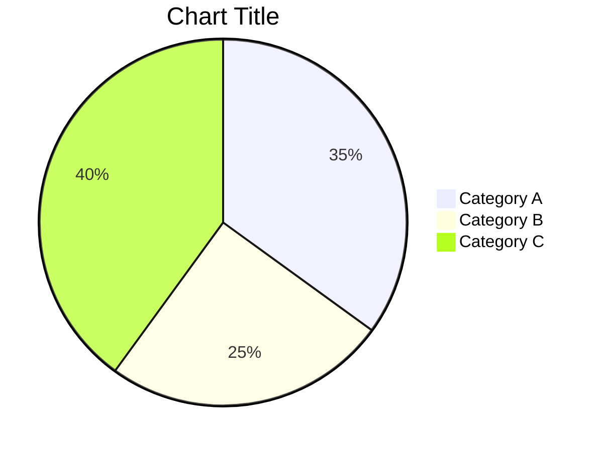
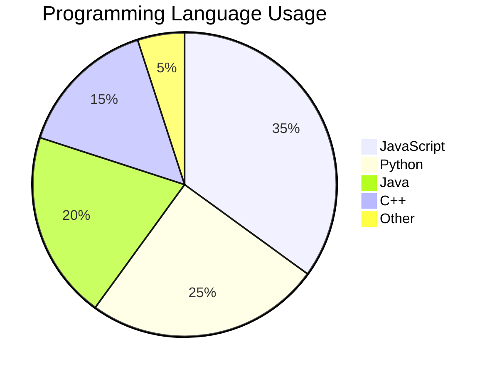
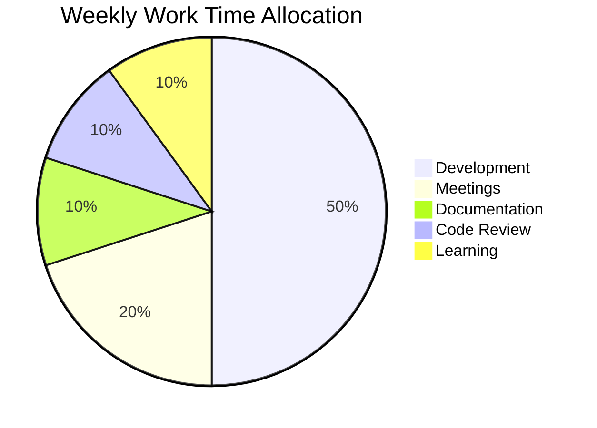
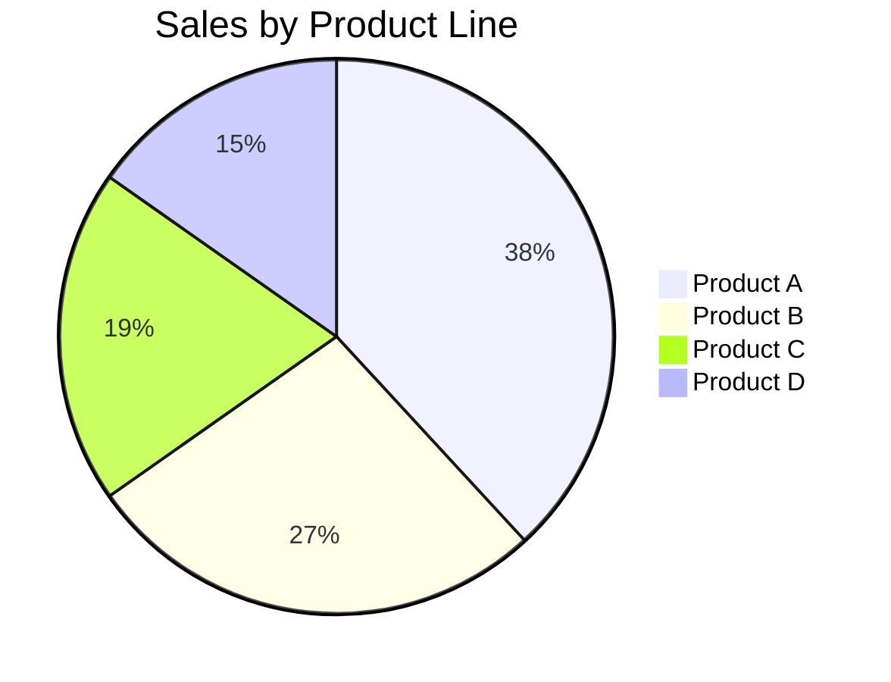

# Pie Chart Detailed Syntax

## Basic Syntax

## Complete Examples

### Programming Language Usage

### Weekly Time Allocation

### Sales by Product Line

## Notes

1. Values are automatically converted to percentages
2. Use double quotes for labels
3. At least 2 data items required

## Common Use Cases

1. **Market share** - Competitor proportions
2. **Budget allocation** - Department/project budget ratios
3. **Time allocation** - Activity time proportions
4. **Survey results** - Response option proportions
