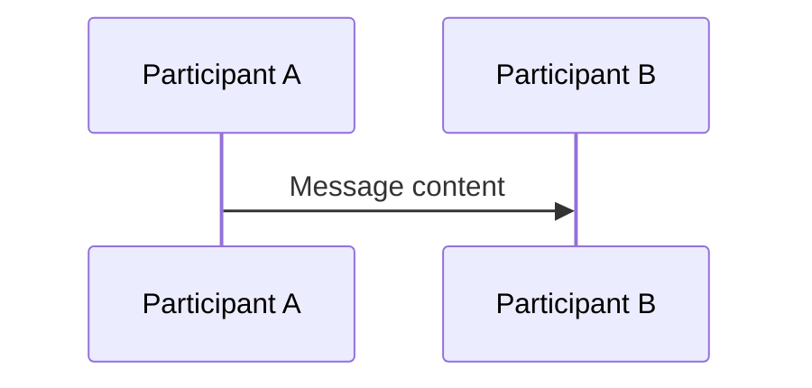
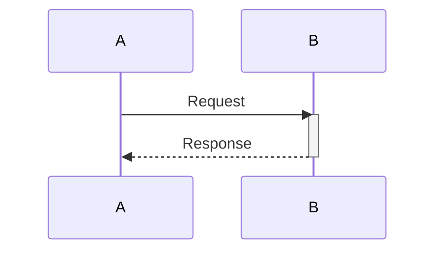
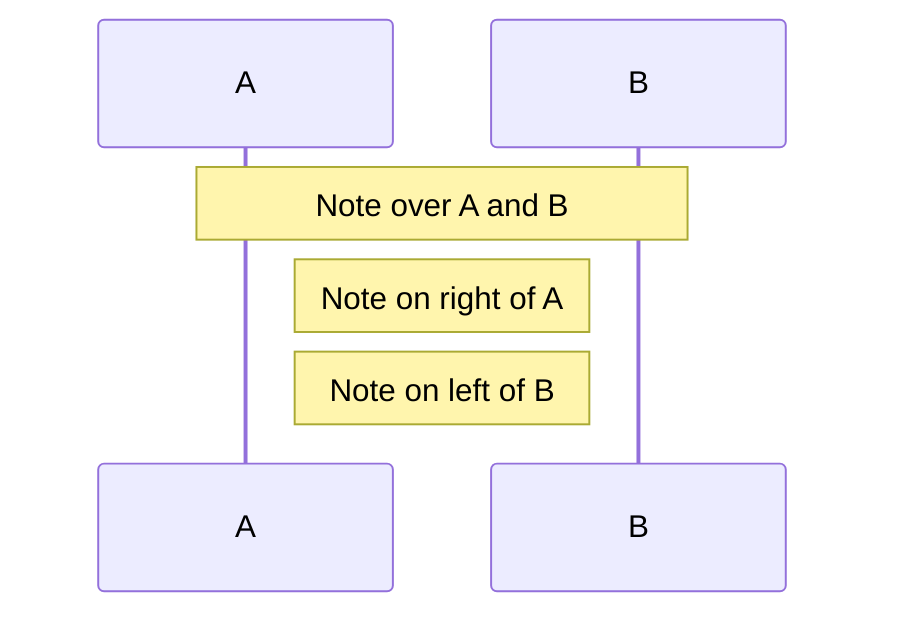
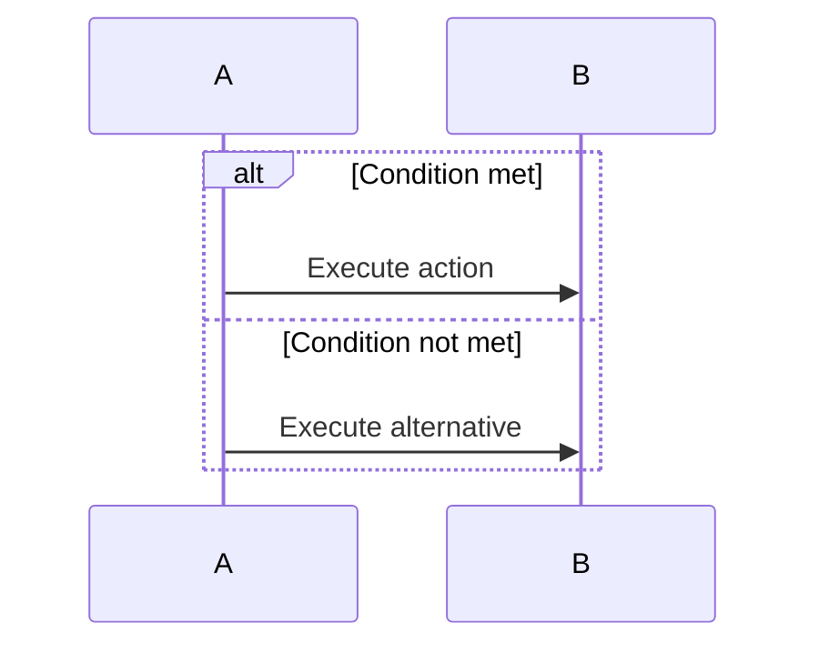
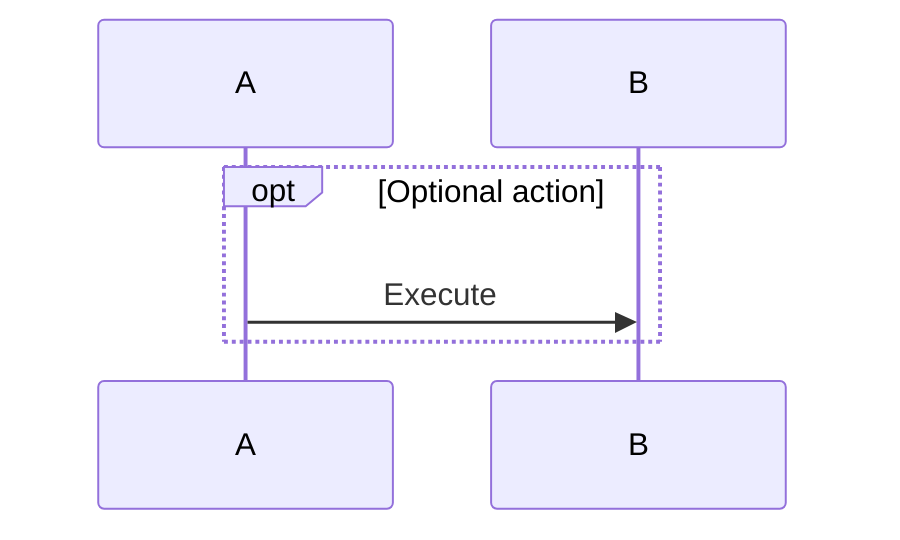
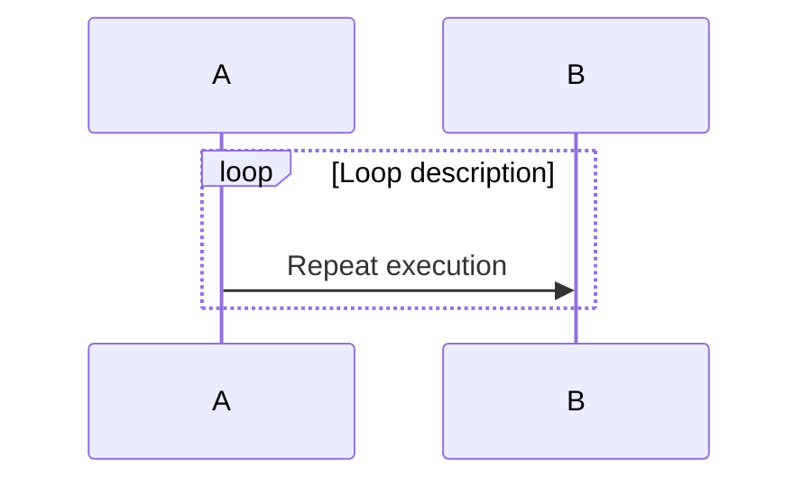
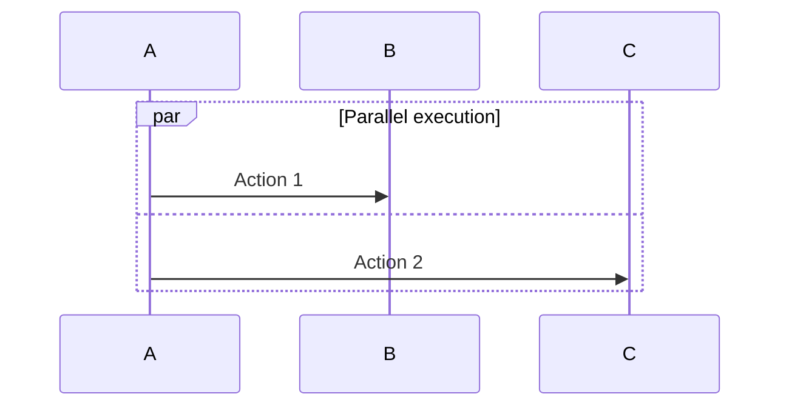
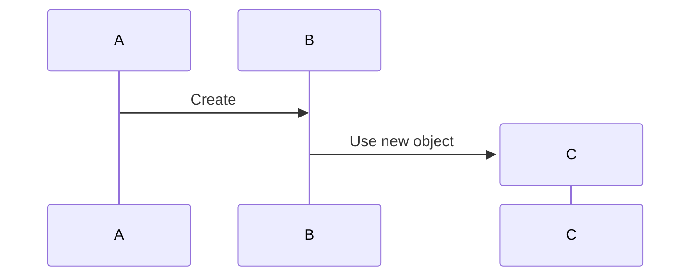
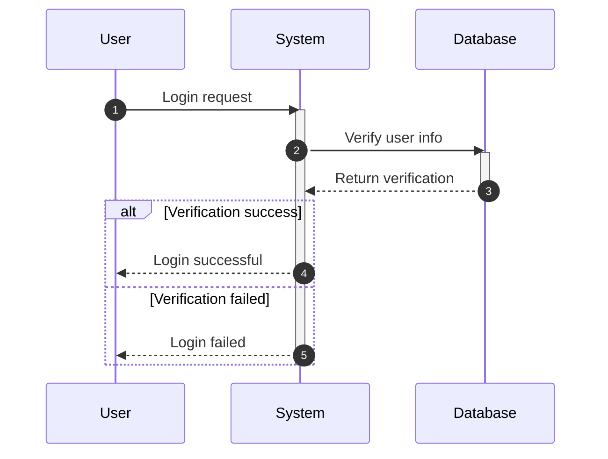
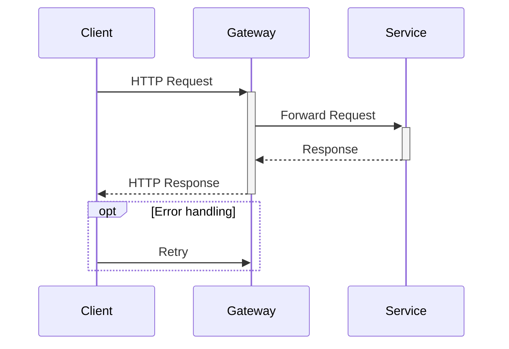

# Sequence Diagram Detailed Syntax

## Basic Syntax



## Participants

### Define Participants

```
participant Name
participant Alias as Display Name
```

### Participant Types

| Syntax | Shape |
|--------|-------|
| `participant A` | Rectangle |
| `actor A` | Actor icon |
| `boundary A` | Boundary box |
| `control A` | Control circle |
| `entity A` | Entity box |
| `database A` | Cylinder |

## Message Types

| Syntax | Type | Description |
|--------|------|-------------|
| `A->>B` | Solid arrow | Synchronous message |
| `A-->>B` | Dashed arrow | Return message |
| `A->B` | Solid line | Synchronous (no arrow) |
| `A--B` | Dashed line | Dashed message |
| `A-xB` | Solid cross | Destroy/terminate |
| `A--xB` | Dashed cross | Dashed terminate |
| `A-)B` | Open arrow | Asynchronous message |
| `A--)B` | Dashed open | Dashed asynchronous |

## Activation Bars



Or shorthand:
```
A->>+B: Request (auto-activate)
B-->>-A: Response (auto-deactivate)
```

## Notes



## Conditional Branches

### Alt (if-else)



### Opt (Optional)



### Loop



### Par (Parallel)



## Create Participants Dynamically



## Auto Numbering

```
sequenceDiagram
    autonumber
    participant A
    participant B
```

## Complete Examples

### User Login Flow



### API Call



## Common Use Cases

1. **API interactions** - Calls between client, gateway, service
2. **User flows** - User interactions with system
3. **Protocol specifications** - Message exchange in network protocols
4. **Async processing** - Using async messages and parallel execution
