# State Diagram Detailed Syntax

## Basic Syntax

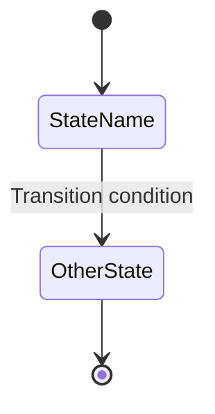

**Note:** Use `stateDiagram-v2` version, not the old `stateDiagram`

## States

### Simple State with ID Only

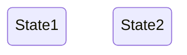

### State with Description (using state keyword)

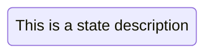

### State with Description (using colon)


## Transitions

Transitions are represented using `-->` arrow syntax.

### Basic Transition

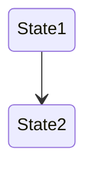

### Transition with Label

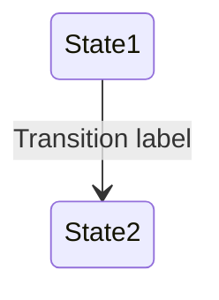

### Self Transition

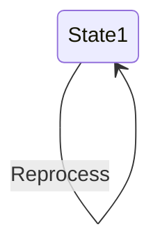

## Start and End States

Use `[*]` syntax for start and end states. The direction determines if it's a start or end state.

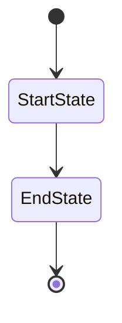

## Composite States

Composite states contain internal states. Use `state` keyword with `{}` body.

### Basic Composite State

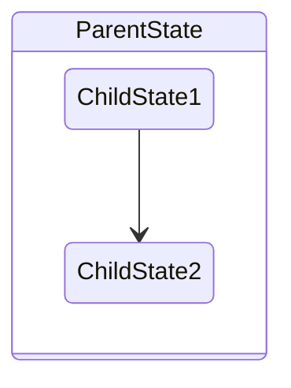

### Nested Composite States

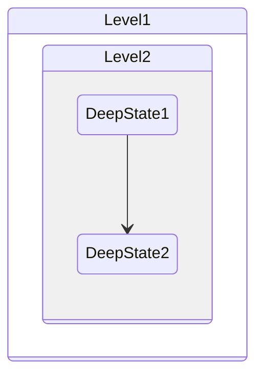

### Transitions Between Composite States

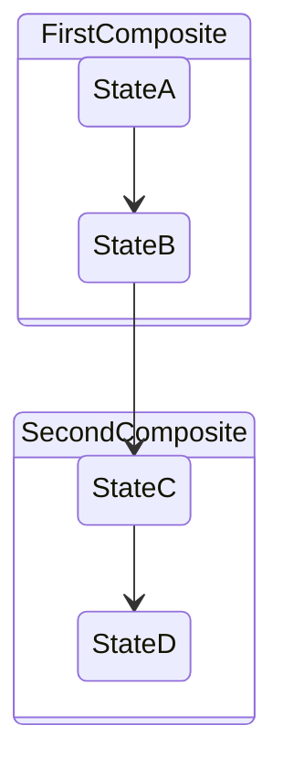

**Note:** You cannot define transitions between internal states belonging to different composite states.

## Choice

Model choices between paths using `<<choice>>`.

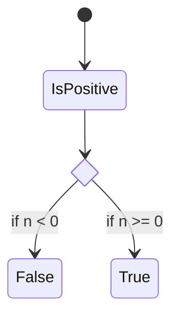

## Forks and Joins

Specify forks and joins using `<<fork>>` and `<<join>>`.

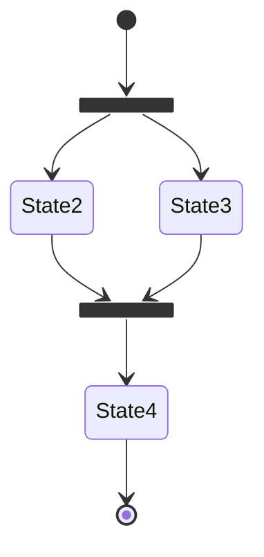

## Notes

Add notes to the left or right of a state.

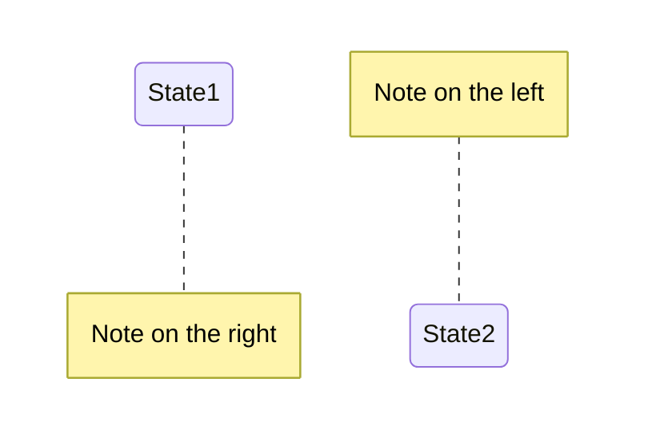

## Concurrency

Specify concurrent states using `--` separator.

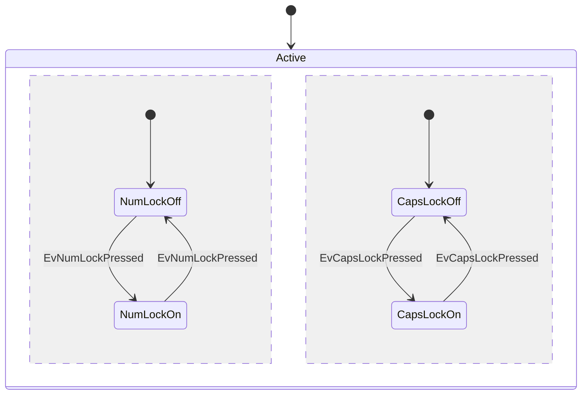

## Setting Diagram Direction

Control the rendering direction of the diagram.

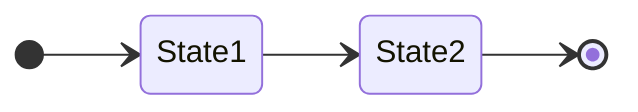

**Direction options:**
- `TD` - Top to Down (default)
- `LR` - Left to Right
- `RL` - Right to Left
- `BT` - Bottom to Top

## Comments

Add comments using `%%` prefix. Comments are ignored by the parser.

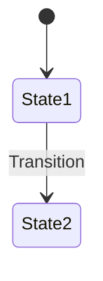

## Styling with classDefs

Define and apply custom styles using `classDef`.

### Define a Style

```
classDef styleName property:value,property2:value2
```

**Example:**
```
classDef movement font-style:italic
classDef badEvent fill:#f00,color:white,stroke:yellow
```

### Apply Styles with `class` Statement

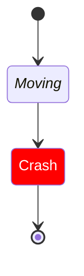

### Apply Styles with `:::` Operator

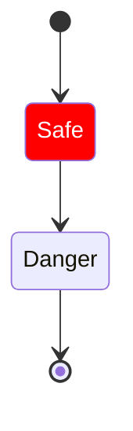

**Limitations:**
- Cannot be applied to start (`[*]`) or end states directly
- Cannot be applied to or within composite states

## Spaces in State Names

Use an ID with description for state names containing spaces.

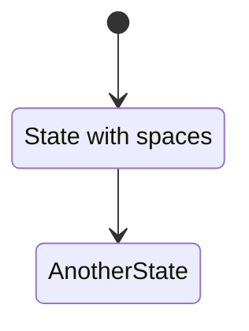

## Complete Examples

### Order State Machine

```mermaid
stateDiagram-v2
    [*] --> PendingPayment
    PendingPayment --> Paid: Payment successful
    PendingPayment --> Cancelled: Timeout
    Paid --> Shipping: Merchant ships
    Shipping --> Completed: Confirm receipt
    Shipping --> Refunding: Request refund
    Refunding --> Completed: Refund successful
    Completed --> [*]
```

### User Authentication with Notes

```mermaid
stateDiagram-v2
    [*] --> LoggedOut
    LoggedOut --> LoggedIn: Login
    LoggedIn --> LoggedOut: Logout
    
    note right of LoggedOut: User is not authenticated
    note left of LoggedIn: User has valid session
```

## Common Use Cases

1. **Business processes** - Order, approval workflow states
2. **UI states** - Page and component state transitions
3. **Game states** - Game flow control (menu, playing, paused)
4. **Device control** - Machine and device state management
5. **User sessions** - Authentication and authorization states
6. **Protocol states** - Network protocol state machines
