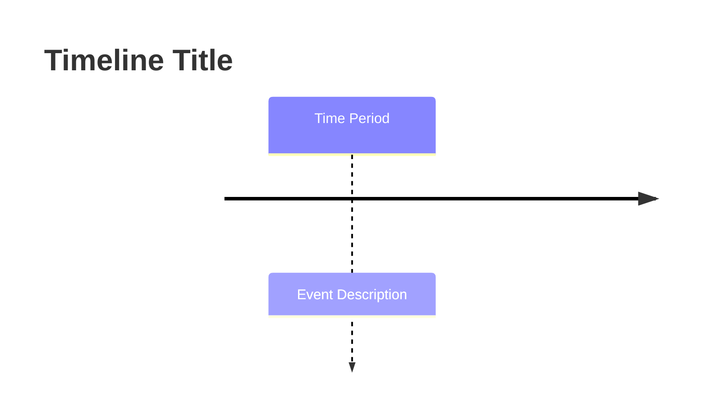
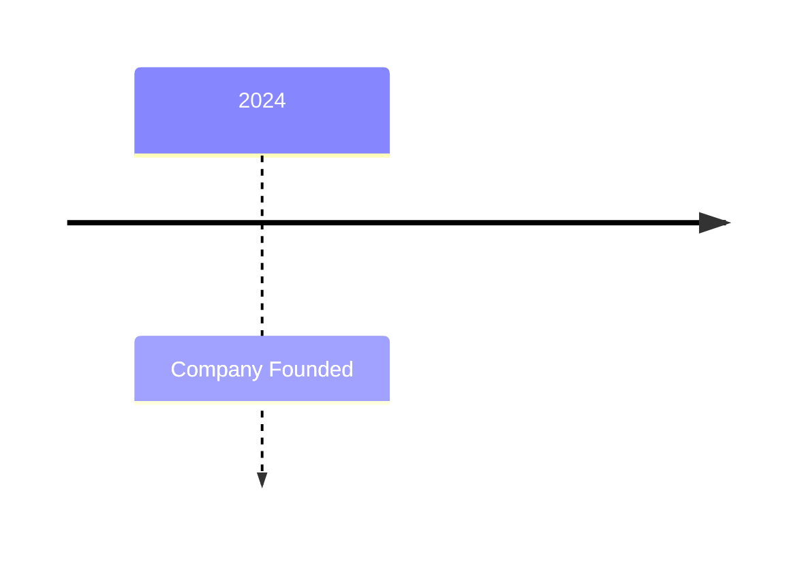
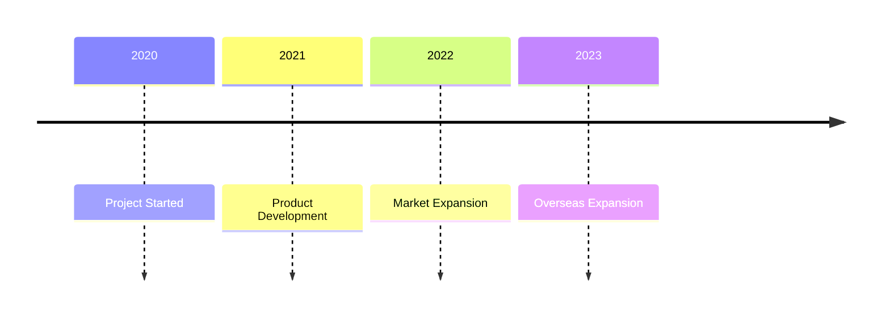
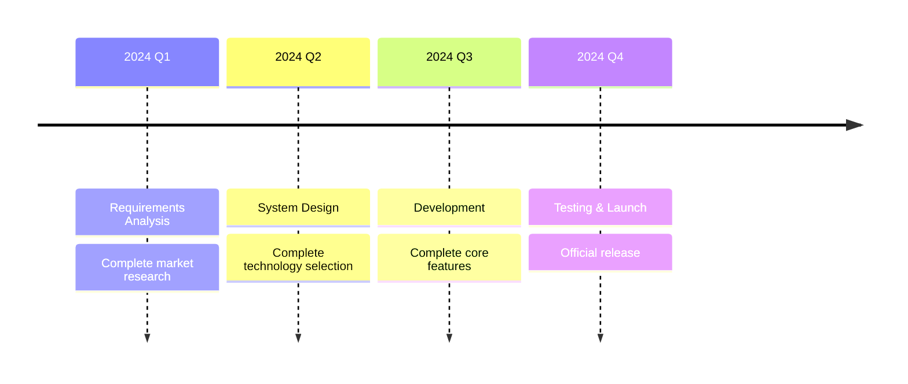
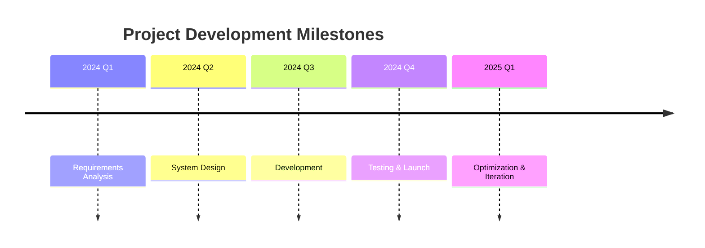
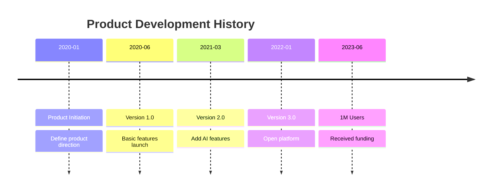
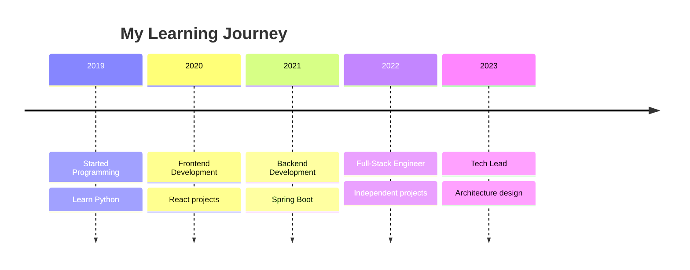

# Timeline Detailed Syntax

## Basic Syntax



## Basic Structure

### Single Time Period



### Multiple Time Periods



### With Subtitles



## Time Period Formats

| Format | Example |
|--------|---------|
| Year | `2024` |
| Quarter | `2024 Q1` |
| Month | `2024-01` |
| Date | `2024-01-15` |
| Range | `Jan-Mar` |

## Event Description

Separate main event and subtitle with `:`:
```
Time Period : Main Event : Subtitle : More Details
```

## Complete Examples

### Project Milestones



### Product History



### Personal Growth Timeline



## Common Use Cases

1. **Project history** - Record project development
2. **Product roadmap** - Show product planning
3. **Personal resume** - Career development timeline
4. **Company history** - Corporate milestones
5. **Version history** - Software release records
