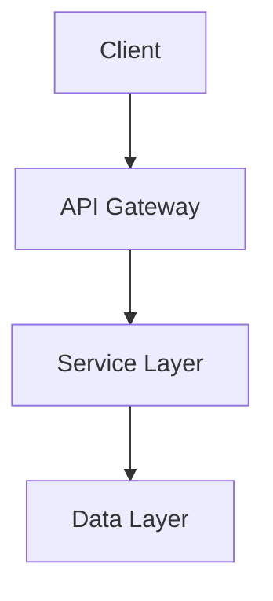
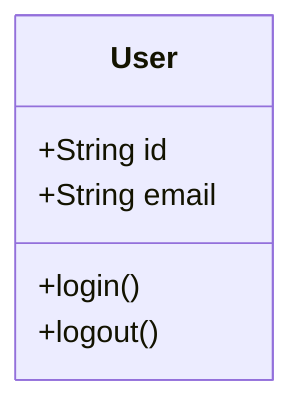
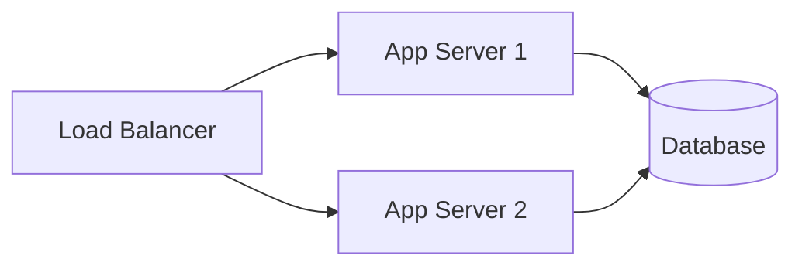

# System Design

## Overview

<!-- Brief description of the system and its purpose -->

## Architecture

<!-- High-level architecture diagram -->

## Modules

| Module | Description | Link |
|--------|-------------|------|
| auth | Authentication & authorization | [auth/](auth/README.md) |
| api | REST API layer | [api/](api/README.md) |
| core | Core business logic | [core/](core/README.md) |

## Technical Decisions

### Architecture Choices
- **Decision**: Brief description
- **Rationale**: Why this approach was chosen
- **Alternatives considered**: Other options evaluated

### Technology Stack
- **Language**: Python 3.10+
- **Framework**: [Framework name]
- **Database**: [Database choice]

## Data Model

<!-- Core data structures and relationships -->

## API Design

### Endpoints
| Method | Path | Description |
|--------|------|-------------|
| GET | /api/users | List users |
| POST | /api/users | Create user |

## Security Considerations

- Authentication mechanism
- Authorization model
- Data protection measures

## Deployment

<!-- Deployment architecture and considerations -->

