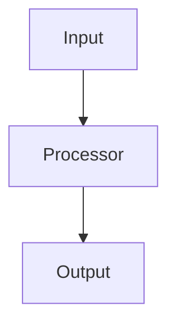
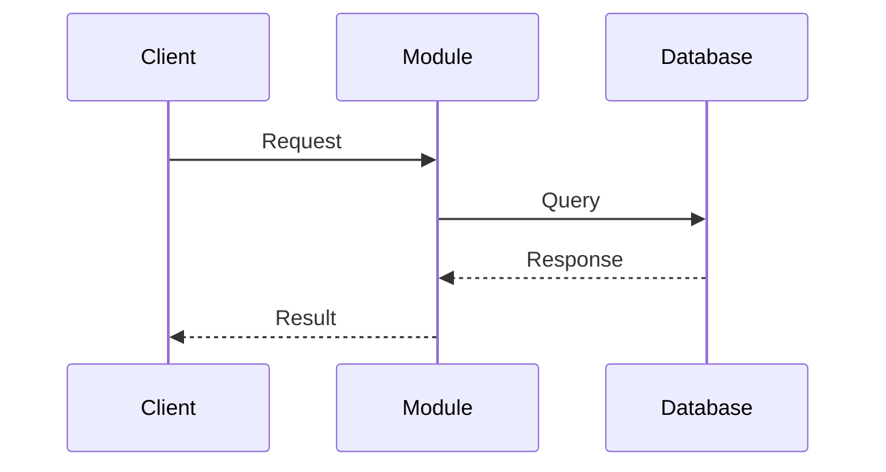
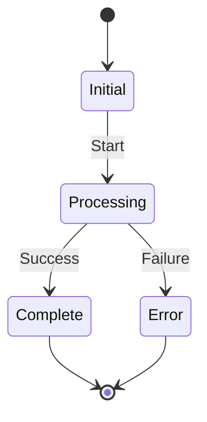

# ${Module Name} Design

## Overview

<!-- Purpose and responsibilities of this module -->

**Responsibilities:**
- Primary responsibility 1
- Primary responsibility 2
- Primary responsibility 3

**Non-responsibilities:**
- What this module does NOT handle

## Architecture

### Component Diagram



### Components

| Component | Description |
|-----------|-------------|
| ComponentA | Handles X |
| ComponentB | Handles Y |

## Interfaces

### Public API

<!-- Functions/classes exposed by this module -->

```python
# Example public interface
class ModuleClass:
    def public_method(self, param: str) -> Result:
        """Public method description."""
        pass
```

### Dependencies

<!-- Other modules this module depends on -->

| Dependency | Type | Purpose |
|------------|------|---------|
| auth | Required | Authentication |
| config | Required | Configuration |

## Key Sequences

<!-- Key functional interaction flows within this module -->



### Sequence 1: [Sequence Name]

- **Trigger:** What initiates this flow
- **Participants:** List of participants in this sequence
- **Steps:** Brief description of the interaction
- **Result:** Expected outcome

### Sequence 2: [Sequence Name]

- **Trigger:** What initiates this flow
- **Participants:** List of participants in this sequence
- **Steps:** Brief description of the interaction
- **Result:** Expected outcome

## State Machine

<!-- If applicable: state transitions and conditions -->



### States

| State | Description |
|-------|-------------|
| Initial | Ready to process |
| Processing | Actively processing |
| Complete | Processing finished |
| Error | Error occurred |

### Transitions

| From | To | Trigger |
|------|-----|---------|
| Initial | Processing | Start command |
| Processing | Complete | Success |
| Processing | Error | Failure |

## Error Handling

### Error Types
| Error | Cause | Recovery |
|-------|-------|----------|
| ValidationError | Invalid input | Return error to caller |
| ProcessingError | Internal failure | Retry or escalate |

## Testing Strategy

### Unit Tests
- Test public API methods
- Test edge cases

### Integration Tests
- Test with dependencies
- Test end-to-end flows

## Performance Considerations

- Expected throughput
- Latency requirements
- Caching strategy

## Future Improvements

- Planned enhancements
- Known limitations
